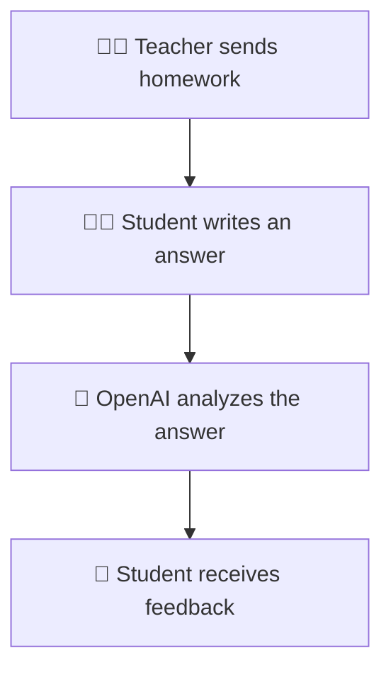

<div align="center">

# 🎓 CheckAI

### A simple AI-powered homework checking system


</div>

---

## 📖 About

**CheckAI** is a small practice project that demonstrates how artificial intelligence can be used to check students' homework.

The application contains two separate portals:

- 👨‍🏫 Teacher Portal
- 👨‍🎓 Student Portal

The teacher creates and sends a homework assignment. The student receives the assignment, writes an answer and submits it through the system.

The submitted answer is analyzed by **OpenAI**. If the answer contains a mistake, the AI explains what is wrong and provides helpful feedback.

---

## ✨ Features

### 👨‍🏫 Teacher

- Create homework assignments
- Send assignments to students
- View submitted answers
- View AI-generated feedback

### 👨‍🎓 Student

- View assigned homework
- Write and submit answers
- Receive AI feedback
- View explanations for mistakes

### 🤖 OpenAI

- Analyzes the student's answer
- Checks the answer for possible mistakes
- Explains incorrect or incomplete answers
- Provides understandable feedback

---

## 🔄 How It Works



---

## 💬 Example

```text
Homework:
Why do plants need sunlight?

Student answer:
Plants need sunlight only to stay warm.

AI feedback:
The answer is incomplete.

Plants mainly need sunlight for photosynthesis.
They use light energy to produce the nutrients required
for growth.
```

---

## 🔑 OpenAI Configuration

The project requires an OpenAI API key.

Create an environment file and add your key:

```env
OPENAI_API_KEY=your_openai_api_key
```

> Never commit your real API key to GitHub.

You can get an API key from the OpenAI Platform.

---

## 🚀 Getting Started

Clone the repository:

```bash
git clone https://github.com/developer2507/CheckAI.git
cd CheckAI
```

Install the required dependencies, configure the environment variables and start the application using the commands required by the project.

---

## 🎯 Project Purpose

CheckAI was created as a practice project to learn and experiment with:

- OpenAI API integration
- AI-powered response analysis
- Teacher and student user roles
- Homework submission workflows
- Full-stack application development

---

## 👨‍💻 Author

<div align="center">

### Anar Ismayilov

**AI Engineer · Full-Stack Developer · Flutter Developer**

<a href="https://github.com/developer2507">
  
</a>

<a href="https://www.linkedin.com/in/anar-ismayilov/">
  
</a>

</div>

---

<div align="center">

**A small project for practicing AI integration in education. 🤖📚**

</div>
