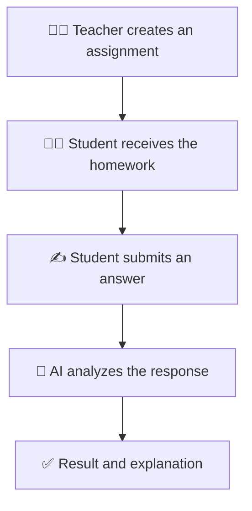

<div align="center">

# 🎓 CheckAI

### AI-powered homework checking for students and teachers

<br/>


<br/><br/>

**CheckAI helps teachers review homework faster and gives students clear explanations when their answers contain mistakes.**

[About](#-about-the-project) •
[How It Works](#-how-it-works) •
[Features](#-core-features) •
[Roadmap](#-roadmap) •
[Author](#-author)

</div>

---

## 📖 About the Project

**CheckAI** is a small AI-powered educational platform with two separate portals:

- 👨‍🏫 **Teacher Portal**
- 👨‍🎓 **Student Portal**

Teachers create and send homework assignments through the platform. Students receive the assignments, complete them and submit their answers.

After an answer is submitted, artificial intelligence analyzes the response, checks it for possible mistakes and provides an understandable explanation.

The purpose of CheckAI is not only to mark an answer as correct or incorrect, but also to help students understand their mistakes and learn from them.

---

## 💡 The Problem

Checking every homework submission manually can take a significant amount of a teacher's time.

At the same time, students often receive only a grade or a short correction without a detailed explanation of what went wrong.

## ✨ The Solution

CheckAI provides an intelligent workflow where:

- Teachers can create and send assignments
- Students can submit answers online
- AI can analyze submitted work
- Mistakes can be identified automatically
- Students can receive clear explanations
- Teachers can review the results

This creates a faster and more educational feedback process.

---

## 🔄 How It Works



### Step-by-step process

1. The teacher creates a homework assignment.
2. The assignment becomes available in the student portal.
3. The student reads the task and submits an answer.
4. AI analyzes the submitted response.
5. If the answer contains a mistake, AI explains what is wrong.
6. The student receives feedback and can learn from the explanation.
7. The teacher can review the student's submission and AI feedback.

---

## 🚀 Core Features

### 👨‍🏫 Teacher Portal

- Create homework assignments
- Send assignments to students
- View student submissions
- Review submitted answers
- See AI-generated analysis
- Monitor homework completion

### 👨‍🎓 Student Portal

- View assigned homework
- Read assignment instructions
- Submit answers through the platform
- Receive AI-powered feedback
- View explanations for mistakes
- Learn from previous submissions

### 🤖 AI Homework Analysis

- Analyze the student's answer
- Check the response against the assignment
- Identify possible mistakes
- Explain why an answer may be incorrect
- Provide clear and educational feedback
- Help students improve their understanding

---

## 🧠 Example AI Feedback

```text
Assignment:
Explain why plants need sunlight.

Student answer:
Plants need sunlight only to stay warm.

AI feedback:
Your answer is incomplete.

Plants primarily need sunlight for photosynthesis.
During photosynthesis, plants use light energy to produce
the nutrients they need to grow.

Sunlight can also affect temperature, but staying warm is
not its main purpose for the plant.
```

Instead of displaying only:

```text
❌ Incorrect answer
```

CheckAI provides:

```text
💡 What is incorrect
📖 Why it is incorrect
✅ A helpful explanation
🎯 Guidance for improvement
```

---

## 👥 User Roles

| Capability | Teacher | Student |
|:---|:---:|:---:|
| Create assignments | ✅ | ❌ |
| Send homework | ✅ | ❌ |
| View assigned homework | ✅ | ✅ |
| Submit an answer | ❌ | ✅ |
| View AI feedback | ✅ | ✅ |
| Review student work | ✅ | ❌ |
| Track completion | ✅ | ✅ |

---

## 🎯 Project Goals

- Make homework checking faster
- Reduce repetitive work for teachers
- Give students immediate feedback
- Explain mistakes in simple language
- Turn incorrect answers into learning opportunities
- Demonstrate the practical use of AI in education

---

## 🏫 Possible Use Cases

CheckAI can be useful for:

- Schools
- Private teachers
- Tutoring centers
- Online courses
- Language learning
- Training programs
- Self-study platforms
- Educational experiments with AI

---

## ⚖️ Responsible AI

AI-generated feedback should support the educational process, not completely replace the teacher.

AI responses may occasionally be incomplete or inaccurate. For important assessments, teachers should review the student's original answer and the generated feedback.

CheckAI is designed to work as an educational assistant:

```text
AI analyzes → Student learns → Teacher remains in control
```

---

## 🗺️ Roadmap

Possible future improvements:

- [ ] Homework deadlines
- [ ] Assignment categories and subjects
- [ ] Student progress tracking
- [ ] Scores and grading criteria
- [ ] Teacher-defined evaluation rubrics
- [ ] Multiple-choice assignments
- [ ] File and image submissions
- [ ] Notifications for new homework
- [ ] Student and teacher dashboards
- [ ] Detailed learning analytics
- [ ] Multilingual AI feedback
- [ ] Teacher correction of AI results
- [ ] Mobile application
- [ ] Parent portal

---

## 🛠️ Getting Started

Clone the repository:

```bash
git clone https://github.com/developer2507/CheckAI.git
cd CheckAI
```

Then configure the required application environment and install the project dependencies according to the technology stack used in the repository.

> Detailed installation instructions can be added here after the frontend, backend, database and AI configuration are finalized.

---

## 🤝 Contributing

CheckAI is currently a small educational project, but suggestions and improvements are welcome.

To contribute:

1. Fork the repository
2. Create a new branch

```bash
git checkout -b feature/your-feature-name
```

3. Make your changes
4. Commit the changes

```bash
git commit -m "Add new feature"
```

5. Push the branch

```bash
git push origin feature/your-feature-name
```

6. Open a Pull Request

---

## 👨‍💻 Author

<div align="center">

### Anar Ismayilov

**AI Engineer · Full-Stack Developer · Flutter Developer**

<br/>

<a href="https://github.com/developer2507">
  
</a>

<a href="https://www.linkedin.com/in/anar-ismayilov/">
  
</a>

<a href="mailto:anar.ismahilov@gmail.com">
  
</a>

</div>

---

<div align="center">

### ⭐ If you find CheckAI interesting, consider giving the repository a star!

**Learn from mistakes. Improve with feedback. Study smarter with AI.**

</div>
